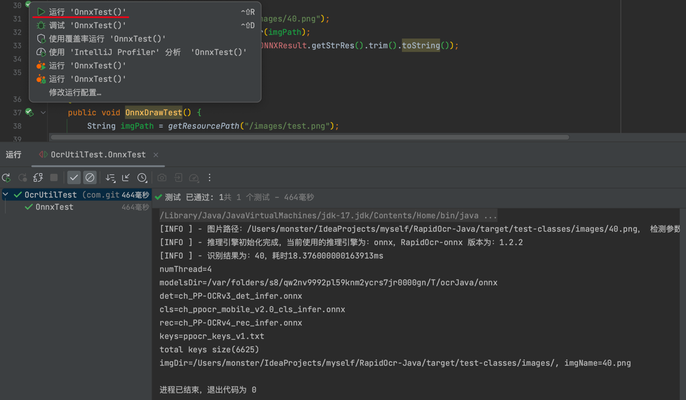

# RapidOcr-Java


## 😺 项目起源

- 现有的JavaOCR工具包识别效果差强人意，PaddleOCR在实现前沿算法的基础上，考虑精度与速度的平衡，进行模型瘦身和深度优化，使其尽可能满足产业落地需求。
- PaddleOCR官方并未提供Java版本，而[RapidOcr](https://github.com/RapidAI/RapidOCR)解决了这个问题，其提供了Kotlin和Java混合版本的[Demo-onnx](https://github.com/RapidAI/RapidOcrOnnxJvm)和[Demo-ncnn](https://github.com/RapidAI/RapidOcrNcnnJvm)

- 而实际使用过程中
  - 项目中并不想再引入Kotlin
  - 不想了解OCR相关知识，开箱即用
  - 不想额外再部署OCR服务


因此本项目将Kotlin部分移除，并在此基础上加以完善且提供了更友好的的调用方法，更方便java开发者直接进行使用。

> 如果该项目对您有帮助，您的star是我不断优化的动力！！！

## 👏 项目特点

- 纯Java代码调用RapidOcr
- 使用ncnn和onnx推理引擎方式，并编写了简单工具类，默认使用Onnx推理方式
- 均使用CPU版本，GPU版本请自行编译

> ⚠️ 注意：当前JVM启动时**只能同时启动一种推理引擎**，以第一次调用runOcr方法时的引擎配置为准


## 🎉 快速开始

### 方式一：本地直接运行

1️⃣ 下载项目

```shell
## 项目含有库文件，导致下载可能较慢
git clone https://github.com/MyMonsterCat/RapidOcr-Java.git
```

2️⃣ 运行[测试类](https://github.com/MyMonsterCat/RapidOcr-Java/blob/main/src/test/java/com/github/monster/ocr/OcrUtilTest.java)



### 方式二：引入到其他项目

1️⃣ 引入jar包(需要自己下载项目打包，过程参考[如何自行打包jar包？](./docs/COMPILE_JAR.md))

```xml
<dependency>
    <groupId>com.github.monster</groupId>
    <artifactId>RapidOcr-Java</artifactId>
    <version>${latest.version}</version>
</dependency>
```

> ⚠️ 注意
>
> - 如果是采用方式二打包，务必将src/resources下的ncnn或者onnx的库文件引入到自己的项目resources中

2️⃣ 调用(更多使用示例请参考[测试类](https://github.com/MyMonsterCat/RapidOcr-Java/blob/main/src/test/java/com/github/monster/ocr/OcrUtilTest.java))

```java
public class OcrUtilTest {

    @Test
    public void NcnnTest() {
        // 使用NCNN引擎进行识别，不要同ONNX使用
        OcrResult NCNNResult = OcrUtil.runOcr(getResourcePath("/images/40.png"), LibConfig.getNcnnConfig(), ParamConfig.getDefaultConfig(), HardwareConfig.getNcnnConfig());
        Assert.assertEquals("40", NCNNResult.getStrRes().trim().toString());
    }

    @Test
    public void OnnxTest() {
        String imgPath = getResourcePath("/images/40.png");
        // 使用ONNX推理引擎进行识别，不要同NCNN使用
        OcrResult ONNXResult = OcrUtil.runOcr(imgPath);
        Assert.assertEquals("40", ONNXResult.getStrRes().trim().toString());
    }
}
```

## 🔝 进阶使用

- [参数调优、版本说明、目录说明、分支说明](./docs/ADVANCED.md)
- [如何自行更新模型](./docs/UPDATE_MODEL.md)
- [如何自行编译动态库](./docs/COMPILE_LIB.md)
- [如何自行打包jar包](./docs/COMPILE_JAR.md)
- OCR相关知识--❗️待更新
- [JVM下不同PaddleOCR调用方式性能比对，强烈建议阅读👍](./docs/COMPARE.md)
- SpringBoot示例和普通Java程序示例--❗️待更新

## 📌 TODO

- [x] 根据系统版本自适应加载动态库
- [x] 动态库集成到jar中
- [x] 是否删除临时文件夹配置为可选项
- [x] jvm未退出场景连续调用识别结果集乱码[#1](https://github.com/MyMonsterCat/RapidOcr-Java/issues/1)
- [x] 集成ONNX[#2](https://github.com/MyMonsterCat/RapidOcr-Java/issues/2)，感谢[nn200433](https://github.com/nn200433)及[tika-server](https://github.com/nn200433/tika-server)👏 
- [x] 添加日志，规范日志打印
- [x] ONNX支持Mac-Arm64
- [ ] 支持Docker镜像
- [ ] Maven仓库提供packages
- [ ] SpringBoot下，以配置文件方式改造

## 🤔 FAQ

#### Q1:无法运行相应的动态库？

Mac-Arm64、Mac-Intel、Win10、Win11、CentOS-8均经过测试，项目resources目录下的的动态库文件**均可成功加载**，如果您的系统无法运行相应的动态库，请在该系统下尝试[自行编译动态库](./docs/COMPILE_LIB.md)

## 鸣谢

- [RapidOCR](https://github.com/RapidAI/RapidOCR)
- [PaddleOCR](https://github.com/PaddlePaddle/PaddleOCR)

## 开源许可

使用 [Apache License 2.0](https://github.com/MyMonsterCat/DeviceTouch/blob/main/LICENSE)
