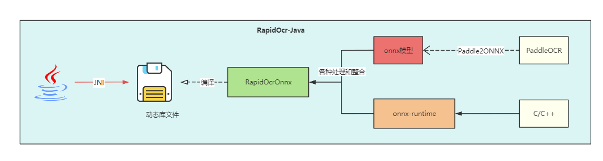
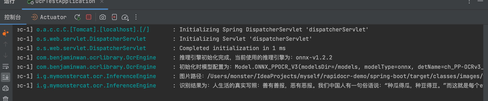

# RapidOcr-Java



## 😺 项目起源

- 现有的JavaOCR工具包识别效果差强人意，[PaddleOCR](https://github.com/PaddlePaddle/PaddleOCR)在实现前沿算法的基础上，考虑精度与速度的平衡，进行模型瘦身和深度优化，使其尽可能满足产业落地需求。
- PaddleOCR官方并未提供Java版本，而[RapidOcr](https://github.com/RapidAI/RapidOCR)解决了这个问题，其提供了Kotlin和Java混合版本的[Demo-onnx](https://github.com/RapidAI/RapidOcrOnnxJvm)和[Demo-ncnn](https://github.com/RapidAI/RapidOcrNcnnJvm)
- 而实际使用过程中 项目中并**不想再引入Kotlin、不想了解OCR相关知识，开箱即用、不想额外再部署OCR服务**

因此本项目将Kotlin部分移除，并在此基础上加以完善且提供了更友好的的调用方法，更方便java开发者直接进行使用。

> [✨如果该项目对您有帮助，您的star是我不断优化的动力！！！](https://github.com/MyMonsterCat/RapidOcr-Java)

## 👏 项目特点

- 纯Java代码调用RapidOcr
- 集成ncnn和onnx推理引擎方式
- 均使用CPU版本，GPU版本请自行编译
- 支持Mac、Windows、Linux等多平台，详细支持的系统请查看[版本说明](./docs/ADVANCED.md)

## 🎉 快速开始

项目提供了[JavaEE](https://github.com/MyMonsterCat/rapidocr-demo/tree/main/java-ee) 和 [SpringBoot](https://github.com/MyMonsterCat/rapidocr-demo/tree/main/spring-boot) 的使用Demo，仅作参考（可以拉取下来运行试一下）

### 1️⃣ 添加依赖

此种方式会根据你使用的系统自动使用对应的jar包，目前支持的系统请查看[版本说明](./docs/ADVANCED.md)

```xml
<!--  rapidocr这个必须要引入     -->
<!--  可前往maven中央仓库https://repo1.maven.org/maven2/io/github/mymonstercat/rapidocr/，查看版本      -->
<dependency>
    <groupId>io.github.mymonstercat</groupId>
    <artifactId>rapidocr</artifactId>
    <version>0.0.7</version>
</dependency>

<!--  一般只需要引入一个，CPU端建议使用onnx，移动端建议使用ncnn     -->
<!--  可前往maven中央仓库https://repo1.maven.org/maven2/io/github/mymonstercat/，查看版本      -->
<dependency>
    <groupId>io.github.mymonstercat</groupId>
    <artifactId>rapidocr-onnx-platform</artifactId>
    <version>0.0.7</version>
</dependency>

<dependency>
    <groupId>io.github.mymonstercat</groupId>
    <artifactId>rapidocr-ncnn-platform</artifactId>
    <version>0.0.7</version>
</dependency>
```

### 2️⃣ 使用示例

```java
public class Main {
    public static void main(String[] args) {
        InferenceEngine engine = InferenceEngine.getInstance(Model.ONNX_PPOCR_V3);
        OcrResult ocrResult = engine.runOcr("/images/test.png");
        System.out.println(ocrResult.getStrRes().trim());
    }
}
```

> 更多使用示例请参考[使用示例](https://github.com/MyMonsterCat/rapidocr-demo/blob/main/java-ee/src/main/java/io/github/mymonstercat/Main.java)

### 3️⃣ 添加打印日志(可选)

项目中添加了日志打印，方便打印OCR日志，请自行添加日志实现（springboot自带，可以不用添加）

```xml
<!-- 非SpringBoot项目：例如添加slf4j-simple     -->
<dependency>
    <groupId>org.slf4j</groupId>
    <artifactId>slf4j-simple</artifactId>
    <version>2.0.3</version>
</dependency>
<!-- SpringBoot项目：去除依赖，防止冲突     -->
<dependency>
    <groupId>io.github.mymonstercat</groupId>
    <artifactId>rapidocr</artifactId>
    <exclusions>
        <exclusion>
            <artifactId>slf4j-api</artifactId>
            <groupId>org.slf4j</groupId>
        </exclusion>
    </exclusions>
</dependency>
```

添加后效果如下：



> ⚠️ 注意：当前JVM启动时**只能同时启动一种推理引擎**，以第一次调用runOcr方法时的引擎配置为准

## 🔝 进阶使用

- [参数调优、版本说明、分支说明](./docs/ADVANCED.md)
- [如何打包jar包在Linux系统上运行](./docs/COMPILE_JAR.md)
- [如何在CentOS7或其他低版本Linux系统上运行](./docs/CentOS7.md)
- [SpringBoot示例和普通Java程序示例](https://github.com/MyMonsterCat/rapidocr-demo)
- [JVM下不同PaddleOCR调用方式性能比对👍](./docs/COMPARE.md)

## 📌 TODO

- [x] 根据系统版本自适应加载动态库
- [x] 动态库集成到jar中
- [x] 是否删除临时文件夹配置为可选项
- [x] jvm未退出场景连续调用识别结果集乱码[#1](https://github.com/MyMonsterCat/RapidOcr-Java/issues/1)
- [x] 集成ONNX[#2](https://github.com/MyMonsterCat/RapidOcr-Java/issues/2)，感谢[nn200433](https://github.com/nn200433)及[tika-server](https://github.com/nn200433/tika-server)👏 
- [x] 添加日志，规范日志打印
- [x] ONNX支持Mac-Arm64
- [ ] 支持Docker镜像
- [x] Maven仓库提供packages
- [ ] SpringBoot下，以配置文件方式改造
- [x] 多模块打包[#6](可以否将dll，所以还有onnx文件分别存放进jar)
- [x] 多线程情况下库和模型可能重复加载、编译目标jdk版本改为1.8，感谢[FlyInWind1](https://github.com/FlyInWind1)
- [x] CentOS7升级指引

## 🤔 FAQ

#### Q1:CentOS7无法运行？

请参考[CentOS7升级GCC](./docs/CentOS7.md)

#### Q2:如何使用自己编译的动态库和模型？

自0.0.5版本开始，项目引入了多模块打包，如果不喜欢这种方式，请使用0.0.4-light

```xml
<dependency>
    <groupId>io.github.mymonstercat</groupId>
    <artifactId>rapidocr</artifactId>
    <version>0.0.4-light</version>
</dependency>
```

代码位于`0.0.4-light分支`，但该分支后续不进行维护。在该分支代码下，你可能会需要以下帮助

- [如何更新模型](./docs/UPDATE_MODEL.md)
- [如何自行编译动态库](./docs/COMPILE_LIB.md)


> 如有其他问题请提issue，我会尽快解决。

## 鸣谢

- [RapidOCR](https://github.com/RapidAI/RapidOCR)
- [PaddleOCR](https://github.com/PaddlePaddle/PaddleOCR)

## 开源许可

使用 [Apache License 2.0](https://github.com/MyMonsterCat/DeviceTouch/blob/main/LICENSE)
