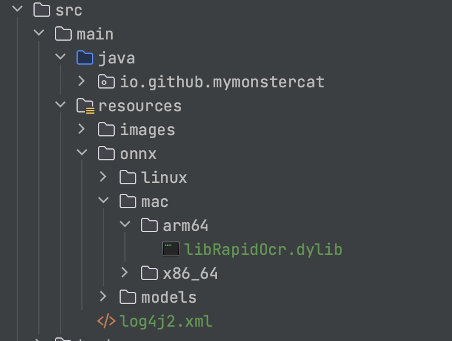

# RapidOcr-Java


## 😺 项目起源

- 现有的JavaOCR工具包识别效果差强人意，PaddleOCR在实现前沿算法的基础上，考虑精度与速度的平衡，进行模型瘦身和深度优化，使其尽可能满足产业落地需求。
- PaddleOCR官方并未提供Java版本，而[RapidOcr](https://github.com/RapidAI/RapidOCR)解决了这个问题，其提供了Kotlin和Java混合版本的[Demo-onnx](https://github.com/RapidAI/RapidOcrOnnxJvm)和[Demo-ncnn](https://github.com/RapidAI/RapidOcrNcnnJvm)
- 而实际使用过程中 项目中并不想再引入Kotlin、不想了解OCR相关知识，开箱即用、不想额外再部署OCR服务

因此本项目将Kotlin部分移除，并在此基础上加以完善且提供了更友好的的调用方法，更方便java开发者直接进行使用。

> [✨如果该项目对您有帮助，您的star是我不断优化的动力！！！](https://github.com/MyMonsterCat/RapidOcr-Java)

## 👏 项目特点

- 纯Java代码调用RapidOcr
- 提供ncnn和onnx推理引擎方式，并编写了简单工具类，默认使用Onnx推理方式
- 均使用CPU版本，GPU版本请自行编译

> ⚠️ 注意：当前JVM启动时**只能同时启动一种推理引擎**，以第一次调用runOcr方法时的引擎配置为准


## 🎉 快速开始

### 1️⃣ 引入jar包

```xml
// 可前往maven中央仓库https://repo1.maven.org/maven2/io/github/mymonstercat/rapidocr/，查看版本
<dependency>
    <groupId>io.github.mymonstercat</groupId>
    <artifactId>rapidocr</artifactId>
    <version>0.0.4-light</version>
</dependency>
```

> ⚠️ version 注意
>
> - 对于`版本号-light，例如0.0.4-light`:轻量级打包，不将库文件打包到jar中
>   - 务必将[release](https://github.com/MyMonsterCat/RapidOcr-Java/releases)下的ncnn或者onnx的库文件引入到自己的项目resources中，请按需引入(例如只需在mac-arm64的机器上运行onnx，见下图)
>   - onnx和ncnn一般只需要引入一个就好，一般来说引入onnx即可，可以在[release](https://github.com/MyMonsterCat/RapidOcr-Java/releases)下test-ocr查看示例引入
>
> 
>
> - 对于`版本号，例如0.0.4`：重量级打包，将全部库文件打包到jar中，项目直接引入即可，不需要额外操作，下载速度可能会比较慢

### 2️⃣ 引入日志包

```xml
<dependency>
    <groupId>org.apache.logging.log4j</groupId>
    <artifactId>log4j-slf4j-impl</artifactId>
    <version>2.20.0</version>
    <scope>compile</scope>
</dependency>
```

由于项目中添加了日志打印，方便查看OCR结果，但是又不想与被引入项目原有的日志冲突，所以在编译jar时未将其进行包括，故需要手动引入日志包。

常见的日志配置如下，可将其放入到项目resources目录下。

```xml
<?xml version="1.0" encoding="UTF-8"?>
<Configuration status="INFO">
    <Appenders>
        <Console name="console" target="SYSTEM_OUT">
            <PatternLayout
                    pattern="[%-5level] - %msg%n"/>
        </Console>
    </Appenders>
    <Loggers>
        <Root level="info" additivity="false">
            <AppenderRef ref="console"/>
        </Root>
        <Logger name="ocrLibrary" level="info" additivity="false">
            <AppenderRef ref="console"/>
        </Logger>
    </Loggers>
</Configuration>
```

### 3️⃣ 使用示例 (更多使用示例请参考[测试类](https://github.com/MyMonsterCat/RapidOcr-Java/blob/main/src/test/java/com/github/monster/ocr/OcrUtilTest.java))

```java
public class Main {
    public static void main(String[] args) {
				// 参数配置自行查看
        ParamConfig paramConfig = ParamConfig.getDefaultConfig();
        paramConfig.setDoAngle(true);
        paramConfig.setMostAngle(true);
				// 对项目根目录images包内图片进行OCR，请自行替换
        String imgPath1 = getResourcePath("/images/40.png");
        OcrUtil.runOcr(imgPath1, LibConfig.getOnnxConfig(), paramConfig);

        String imgPath2 = getResourcePath("/images/system.png");
        OcrUtil.runOcr(imgPath2, LibConfig.getOnnxConfig(), paramConfig);

        String imgPath3 = getResourcePath("/images/test.png");
        OcrUtil.runOcr(imgPath3, LibConfig.getOnnxConfig(), paramConfig);
    }

    private static String getResourcePath(String path) {
        return new File(Main.class.getResource(path).getFile()).toString();
    }
}
```

运行结果如下


> 如果想去除最底下numThread=4等控制台打印，需要在编译库文件的时候进行控制，可以在[如何自行编译动态库](./docs/COMPILE_LIB.md)查看教程。
>
> 后续有时间会将所有库的控制台打印去掉，目前仅去掉了Mac-arm64的，望理解。

## 🔝 进阶使用

- [参数调优、版本说明、目录说明、分支说明](./docs/ADVANCED.md)
- [如何自行更新模型](./docs/UPDATE_MODEL.md)
- [如何自行编译动态库](./docs/COMPILE_LIB.md)
- [如何自行打包jar包](./docs/COMPILE_JAR.md)
- OCR相关知识--❗️待更新
- [JVM下不同PaddleOCR调用方式性能比对，强烈建议阅读👍](./docs/COMPARE.md)
- SpringBoot示例和普通Java程序示例--❗️待更新

## 📌 TODO

- [x] 根据系统版本自适应加载动态库
- [x] 动态库集成到jar中
- [x] 是否删除临时文件夹配置为可选项
- [x] jvm未退出场景连续调用识别结果集乱码[#1](https://github.com/MyMonsterCat/RapidOcr-Java/issues/1)
- [x] 集成ONNX[#2](https://github.com/MyMonsterCat/RapidOcr-Java/issues/2)，感谢[nn200433](https://github.com/nn200433)及[tika-server](https://github.com/nn200433/tika-server)👏 
- [x] 添加日志，规范日志打印
- [x] ONNX支持Mac-Arm64
- [ ] 支持Docker镜像
- [x] Maven仓库提供packages
- [ ] SpringBoot下，以配置文件方式改造

## 🤔 FAQ

#### Q1:无法运行相应的动态库？

Mac-Arm64、Mac-Intel、Win10、Win11、CentOS-8均经过测试，项目resources目录下的的动态库文件**均可成功加载**，如果您的系统无法运行相应的动态库，请在该系统下尝试[自行编译动态库](./docs/COMPILE_LIB.md)

#### Q2:CentOS7无法运行？

先提供思路：由于centos7使用的gcc、glibc等工具太老了，而提供的so文件所需的最低依赖版本 **远远大于** centos7的最高版本，因此需要将centos7对应的gcc、glibc等工具进行升级。

具体教程还未整理。


如有其他问题请提issue，我会尽快解决。

## 鸣谢

- [RapidOCR](https://github.com/RapidAI/RapidOCR)
- [PaddleOCR](https://github.com/PaddlePaddle/PaddleOCR)

## 开源许可

使用 [Apache License 2.0](https://github.com/MyMonsterCat/DeviceTouch/blob/main/LICENSE)
