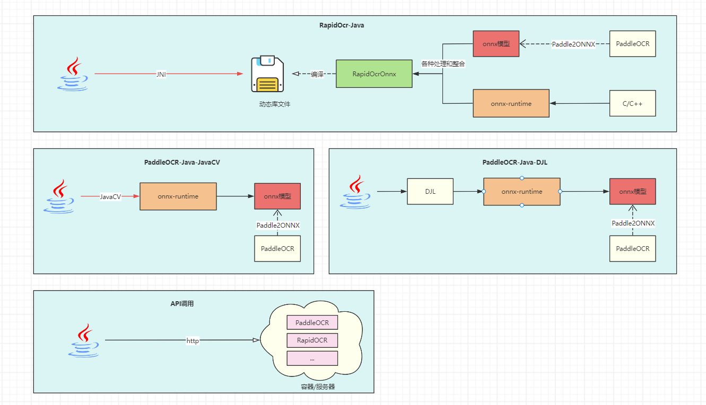

# Java调用OCR方式比较

> 当前更新时间：**2023年12月13日**

|         方式         |                    原理/大致流程                    |                    优点                     |                             缺点                             |                           其他说明                           |
| :------------------: | :-------------------------------------------------: | :-----------------------------------------: | :----------------------------------------------------------: | :----------------------------------------------------------: |
|  使用RapidOcr-Java   |        Java程序通过JNI调用编译好的OCR动态库         | 下载即用，跨平台，开发者无需了解OCR相关知识 |  无法直接对模型进行控制，只能调整相应参数（一般来说够用了）  |                 推荐👍(即本项目，已开源维护)                  |
| 直接调用onnx-runtime |           通过onnx-runtime调用并使用模型            |   下载即用，跨平台，可对模型直接进行控制    |                   开发者需了解OCR相关知识                    |                   推荐👍(开发中，暂未开源)                    |
| 通过DJL实现间接调用  | 不直接使用onnx-runtime，使用DJL间接调用onnx-runtime |     无需关注打包时平台依赖，DJL已整合好     |         DJL语法学习成本较大，开发者需了解OCR相关知识         |                           暂不推荐                           |
|       API调用        |   在服务器/容器中开启OCR服务，通过http请求进行OCR   |                  功能解耦                   | 需要另起服务提供API接口，对于小型系统来说完全没必要再引入Docker等容器 | 自行查找镜像源或web服务，例如[RapidOCR-web版本](https://github.com/RapidAI/RapidOCR) |
