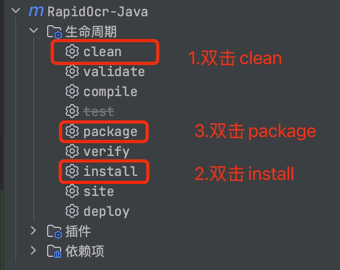
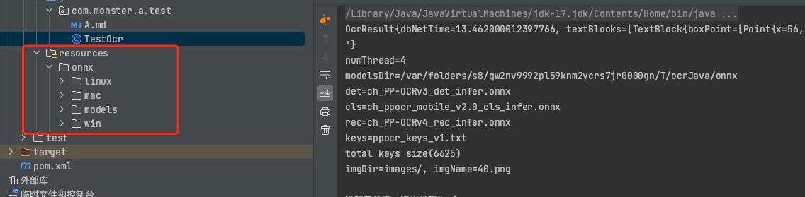

# 如何自行编译 jar 包

## 打包流程

以IDEA界面操作为例




## 方式一：打包动态库

此方式使用了打包插件，会将resources下的所有动态库均打包进jar，这会导致jar包将近100M。

当然，实际使用过程中，可以通过调整includes标签来只打包相应系统的动态库（比如只打包onnx mac-arm64，jar包只有30M左右）

```xml
  <build>
      <resources>
          <resource>
              <directory>src/main/resources</directory>
              <includes>
                  <!--方式一：包含文件夹以及子文件夹下所有资源-->
                  <!-- <include>**/*.*</include> -->
                  <!--方式二：仅打包onnx mac-arm64(按照自己的需求来，推荐👍)-->
                  <include>onnx/mac/arm64/*</include>
                  <include>onnx/models/*</include>
              </includes>
          </resource>
      </resources>
  </build>
```

在这种方式下，当引入该jar后，直接使用即可

## 方式二：不打包动态库

同样的，通过打包插件可以控制不打包动态库，打包后jar只有19KB

```xml
  <build>
      <resources>
          <resource>
              <directory>src/main/resources</directory>
              <excludes>
                  <exclude>**/*.*</exclude>
              </excludes>
          </resource>
      </resources>
  </build>
```

在这种方式下，当引入该jar后，**还需在项目src/main/resources下添加相应的动态**库(如下图所示)



否则会抛出NoSuchFileException


> 具体使用哪种方式还是按照自己的需求来
