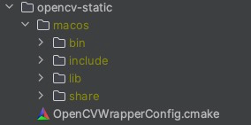
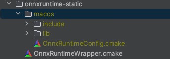
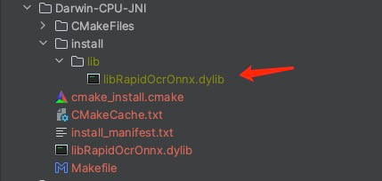
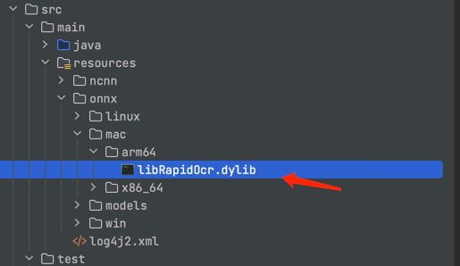
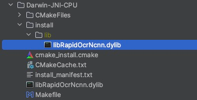
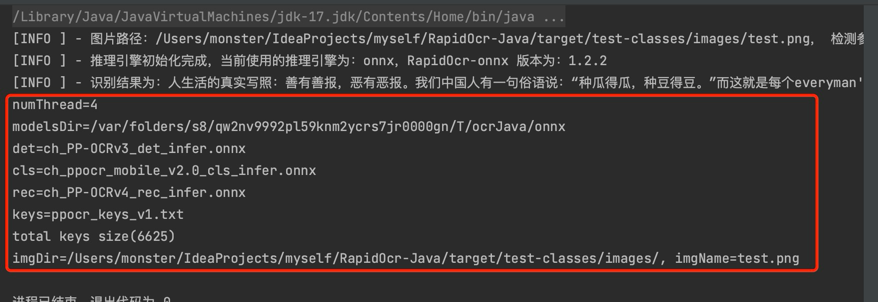
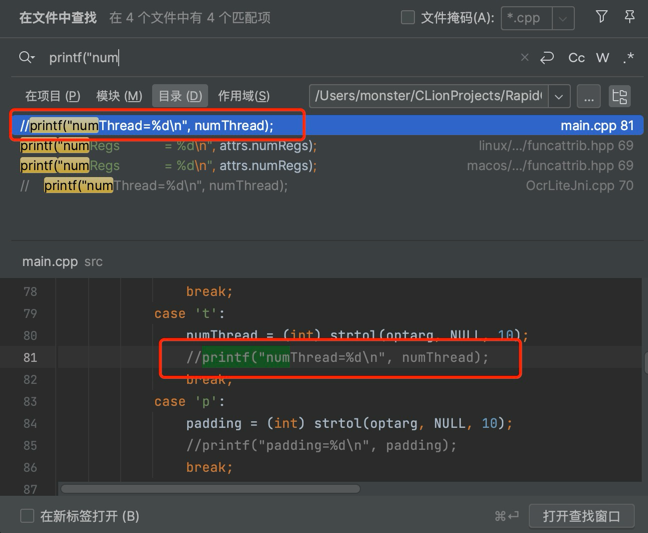

# 如何自行编译JNI动态库？

## 环境准备

- 编译使用的工具是`CLion`2023.1.5版本，工具链如下图，环境搭建请自行搜索解决


- 系统版本为MacOS 14.0，芯片Apple M1

> 其他平台请参考[编译说明](https://github.com/RapidAI/RapidOcrOnnx/blob/main/BUILD.md)，总体步骤是一样的，只是第4部分有区别

## ONNX编译

### 1.下载项目

```shell
git clone https://github.com/RapidAI/RapidOcrOnnx
```

### 2.下载opencv

- [下载地址](https://github.com/RapidAI/OpenCVBuilder/releases)

- 按照自己的系统下载对应压缩包，windows平台分为mt和md版，mt代表静态链接CRT，md代表动态链接CRT
- 把压缩包解压到`opencv-static`，目录结构如下所示

```
opencv-static
├── OpenCVWrapperConfig.cmake
├── linux
├── macos
├── windows-x64
└── windows-x86
```

- 最后效果如下



### 3.下载onnxruntime

- [下载地址](https://github.com/RapidAI/OnnxruntimeBuilder/releases)

- static为静态库，shared为动态库，一般情况下使用静态库即可
- 把压缩包解压到`onnxruntime-static`，目录结构如下所示

```
onnxruntime-static
├── OnnxRuntimeWrapper.cmake
├── linux
├── macos
├── windows-x64
└── windows-x86
```

- 最后效果如下



### 4.MacOS环境配置

- macOS Catalina 10.15.x，安装Xcode>=12，并安装Xcode Command Line Tools, 终端运行`xcode-select –install`
- 自行下载安装HomeBrew，cmake >=3.19[下载地址](https://cmake.org/download/)
- libomp: `brew install libomp`
- 安装Java环境（自行搜索）


### 5.开始编译

- 拉取的代码中，做出如下修改（Mac需要做出更改，如果你是其他系统，**可能不需要**，请根据实际报错信息仔细查看）

```c
将下面的代码
#include <onnxruntime/core/session/onnxruntime_cxx_api.h>
改为
#include <onnxruntime/onnxruntime_cxx_api.h>
// 受影响的文件有: AngleNet.h  CrnnNet.h  DbNet.h  OcrLite.h. OcrUtils.h
```

- 终端打开项目根目录，`./build.sh`并按照提示输入选项，最后选择'JNI动态库'
- 测试：`./run-test.sh`(注意修改脚本内的目标图片路径)

编译结果如下图，其中libRapidOcrOnnx.dylib即为所需库文件



将其替换项目中的库文件即可




## NCNN编译

- ncnn编译步骤同onnx编译类似，请参考[编译说明](https://github.com/RapidAI/RapidOcrNcnn/blob/c2d168dbe685152bf78fab596917fd3da747933b/BUILD.md)，此处不再重复。

- 编译结果如下：



## 去除动态库日志打印

在使用过程中，会发现会在控制台打印配置信息，而且没办法关闭



这是因为在RapidOnnx/RapidNcnn代码中添加了打印日志，所以需要修改源码，去除日志打印。

在CLion中，使用全局搜索：

例如搜索：`printf("numThread=`，找到相应代码注释掉，并重新打包即可

同理可搜索：`printf("modelsDir= `等其他代码并注释掉




> 参考文章
>
> - [ONNX编译说明](https://github.com/RapidAI/RapidOcrOnnx/blob/main/BUILD.md)
> - [NCNN编译说明](https://github.com/RapidAI/RapidOcrNcnn/blob/c2d168dbe685152bf78fab596917fd3da747933b/BUILD.md)

