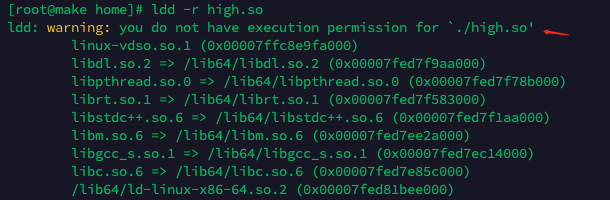
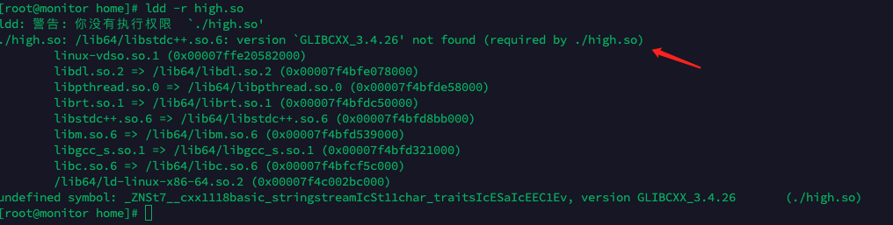
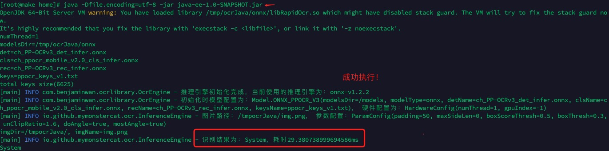

# 如何在CentOS7或其他低版本Linux系统上运行

**为什么CentOS7上不能执行？**

CentOS7都是10几年前的系统了，其使用的gcc、glibc等工具太老了，提供的so文件所需的最低依赖版本 **远远大于** centos7的最高版本，因此有三种方式

- 方式一：在**低版本**gcc、glibc上重新编译.so
  - 能力有限，我自己低版本编译后的so有问题，后续再研究一下
- 方式二：**升级**CentOS7上的gcc、glibc版本，升级也有两种方式
  - 方式一：使用SCL修改版本(自行查找资料)
  - 方式二：编译(本文提供此种方式的指引)
- 方式三：在你的系统上**重新编译.so**
  - 编译请参考[如何自行编译动态库](./docs/COMPILE_LIB.md)

## 0.分析动态库链接

使用`ldd -r /目录/xxx.so`，可以查看动态库链接。

如下图，使用命令查看high.so的动态库链接，从红色箭头往下看⬇️，发现都成功链接了。



> - 此处的high.so你可以替换为 /目录/libRapidOcr.so。因为我有多个版本的该库文件，high是表示高版本的，本质上就是libRapidOcr.so，改名了而已
> - 一般来说，你的库文件可能会位于：**tmp/ocrJava/onnx/libRapid0cr.so** 

下图是链接失败，提示`GLIBCXX_3.4.26 not found`，此时**说明你的环境版本太低了**，需要升级。



一般来说，要想链接成功，需要确保：

- 确保gcc>=9.1.0
- 确保cmake>=4
- 确保GLIBC>=2.26

下文是具体的升级步骤

> ⚠️ 注意：
>
> - 升级Gcc有风险，正式环境升级请做好快照等充足的准备！！！
> - 请充分了解升级的风险后再进行升级！！！

## 1.升级gcc-9.1.0

### 下载

创建并进入到一个临时目录

```shell
mkdir temp
cd /temp
```

下载源码包

```shell
wget http://ftp.gnu.org/gnu/gcc/gcc-9.1.0/gcc-9.1.0.tar.gz
```

解压、进入文件

```shell
tar -zxvf gcc-9.1.0.tar.gz
cd gcc-9.1.0
```

利用源码包里自带的工具下载所需要的依赖项，它会下载几个依赖：**mpfr**、**mpc**、**gmp**，这一步的速度看你的网络情况

```shell
./contrib/download_prerequisites
```

如果报错了，查看gcc-9.1.0里面的**mpfr**、**mpc**、**gmp**相关的文件，删除了重新执行上面的命令即可

### 编译

创建编译输出目录:

```shell
mkdir build
```

进入build目录，并生成Makefile

```shell
cd build

../configure --enable-checking=release --enable-languages=c,c++ --disable-multilib
```

编译，这一步非常耗时，一般是1-3小时左右

```shell
make
```

编译完成之后，安装

```shell
make install
```

### 重新引用

查找最新的动态库

```bash
find / -name "libstdc++.so*"
```

执行结果如下，**重点关注6.0.26（我们需要使用的）**

```shell
/usr/local/lib64/libstdc++.so.6.0.26
/usr/local/lib64/libstdc++.so
/usr/local/lib64/libstdc++.so.6.0.25-gdb.py
/usr/local/lib64/libstdc++.so.6
/usr/lib64/libstdc++.so.6.0.19
/usr/lib64/libstdc++.so.6
/data/result/SegParser/libstdc++.so.6
/data/download_record/SegParser/libstdc++.so.6
/data/segdsegy/SegParser/libstdc++.so.6
```

这代表高版本的动态库，因此需要将此库复制到/usr/lib64/路径下并重新建立软连接

```bash
cd /usr/lib64
cp /usr/local/lib64/libstdc++.so.6.0.26 /usr/lib64/
rm libstdc++.so.6
ln -s libstdc++.so.6.0.26 libstdc++.so.6
```

## 2.升级cmake

默认为3，升级为4

```shell
wget http://ftp.gnu.org/gnu/make/make-4.3.tar.gz
tar -xzvf make-4.3.tar.gz && cd make-4.3/
./configure  --prefix=/usr/local/make
make && make install
cd /usr/bin/ && mv make make.bak
ln -sv /usr/local/make/bin/make /usr/bin/make
```

## 3.升级GLIBC_2.28

```shell
wget http://ftp.gnu.org/gnu/glibc/glibc-2.28.tar.gz
tar xf glibc-2.28.tar.gz 
cd glibc-2.28/ && mkdir build  && cd build
../configure --prefix=/usr --disable-profile --enable-add-ons --with-headers=/usr/include --with-binutils=/usr/bin --disable-werror
make
make install
# 使用下面的命令查看是否存在GLIBC_2.27（注意，看是不是存在2.27！！！）
strings /lib64/libc.so.6 |grep GLIBC_
```

## 测试执行




> 参考文档
>
> - [CentOS7升级GCC版本](https://www.jianshu.com/p/cedbdf0b6bca)
> - [centos7升级gcc](https://blog.csdn.net/qq_41661056/article/details/102626401)
> - [version `GLIBC_2.27' not found ](https://www.cnblogs.com/dingshaohua/p/17103654.html)
> - [glibc 2.17升级2.28](https://blog.csdn.net/weixin_38586230/article/details/107057646)
> - [升级GLIBC并解决系统错误](https://zhuanlan.zhihu.com/p/559791450)
