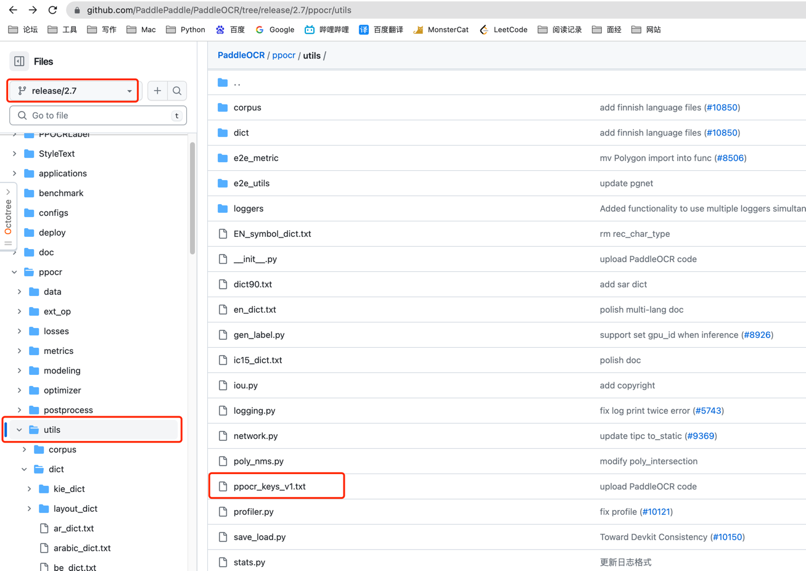
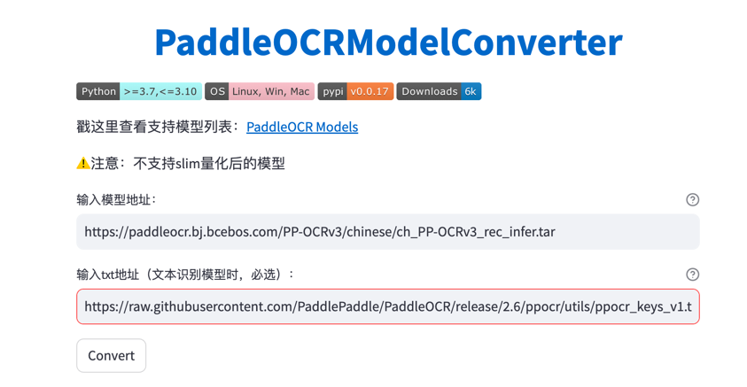

# 如何进行模型更新

1.按照[Rapid官方说明文档](https://rapidai.github.io/RapidOCRDocs/docs/about_model/convert_model/)转换即可

- 前往[魔搭](https://www.modelscope.cn/studios/liekkas/PaddleOCRModelConverter/summary)
- 输入模型地址: 在[官方模型地址](https://github.com/PaddlePaddle/PaddleOCR/blob/release/2.7/doc/doc_ch/models_list.md)选择想转换的模型
- 输入txt地址: 在[官方地址](https://github.com/PaddlePaddle/PaddleOCR)-->选择分支 --> utils --> ppocr_keys_v1.txt

- 点击covert
- 将该模型放入`src\main\resources\onnx\models`
- 修改`PathConstants.MODEL_REC_NAME`为你模型的名称

